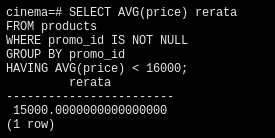
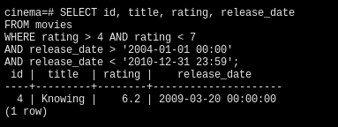

# DAY-2

## PRODUCTS and PROMOS
1. `SELECT AVG(price) rerata FROM products WHERE promo_id IS NOT NULL GROUP BY promo_id HAVING AVG(price) < 16000;`
 

2. `SELECT min(price) FROM products WHERE promo_id IS NOT NULL GROUP BY promo_id;`
 

## MOVIES and ACTORS
1. `SELECT title, release_date FROM movies WHERE release_date > '2020-01-01 00:00 AND release_date < '2020-12-31 23:59';`
 

2. `SELECT name FROM actors WHERE name LIKE ('%s');`
 

3. `SELECT id, title, rating, release_date FROM movies WHERE rating > 4 AND rating < 7 AND release_date > '2004-01-01 00:00' AND release_date < '2010-12-31 23:59';`
 

